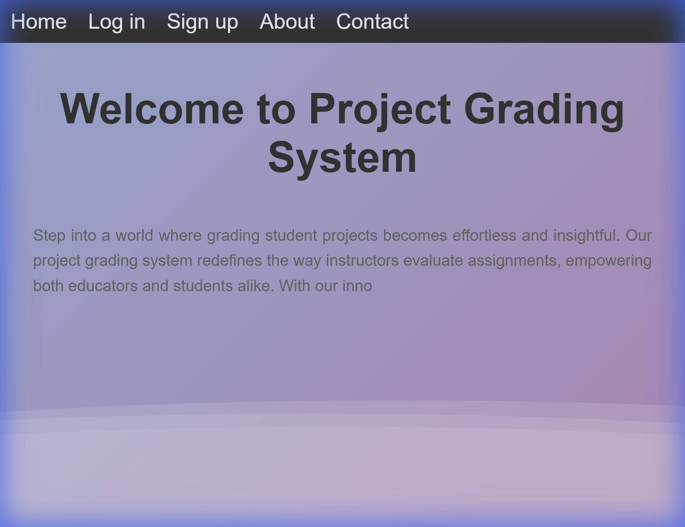

# 📚 Project Grading System

Django web app for managing student project submissions and grading.



## Project Purpose: SRS & SDS

The main objective of this project was the creation of comprehensive **Software Requirements Specification (SRS)** and **Software Design Specification (SDS)** documents. The implementation serves as a proof-of-concept for these design documents.

**Key Design Artifacts:**
- **Use Case Diagrams:** Detailed interactions between Students, Teachers, and Admins.
- **Class Diagrams:** Structural mapping of the system's classes, attributes, and relationships.
- **Sequence Diagrams:** Visualizing the flow of key processes like Grading and Submission.
- **Entity Relationship Diagrams (ERD):** Database schema and data relationships.
- **Activity Diagrams:** Workflow steps for system operations.

## Features

- **Students:** Submit projects, track grades, download PDFs
- **Teachers:** Review and grade student projects
- **Admins:** Approve users, manage roles, send notifications

## Quick Start

```bash
# Install dependencies
pip install -r requirements.txt

# Setup database
python manage.py migrate

# Run server
python manage.py runserver
```

Open `http://127.0.0.1:8000/`

**Default Admin:** Username: `PGS` | Password: `PGS-2024`

## Tech Stack

- Django 5.0.3
- SQLite3
- ReportLab (PDF generation)
- WhiteNoise (static files)

## Configuration

Edit `multaka/settings.py` for email:
```python
EMAIL_HOST_USER = 'your-email@gmail.com'
EMAIL_HOST_PASSWORD = 'your-app-password'
```
